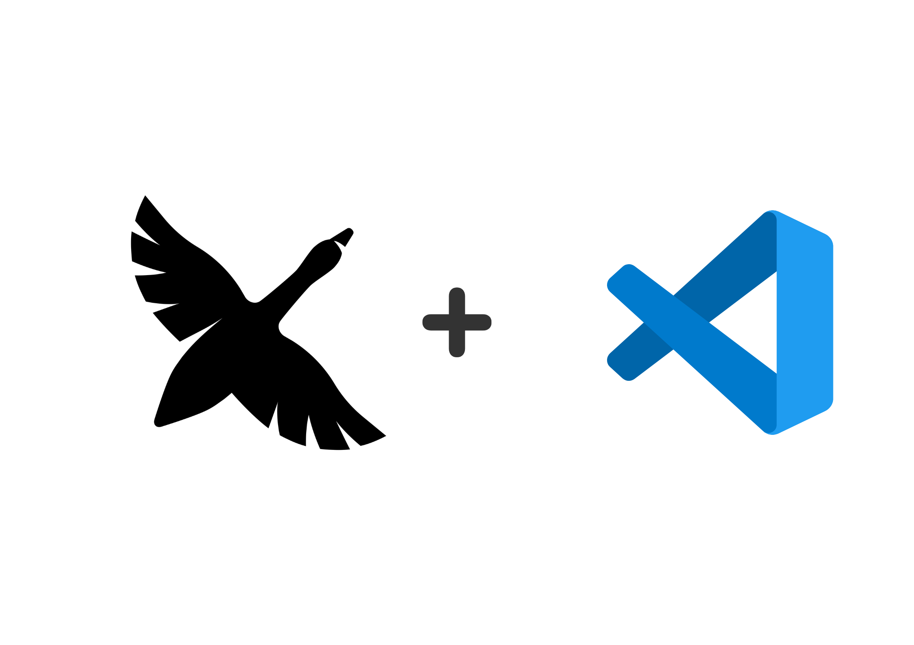
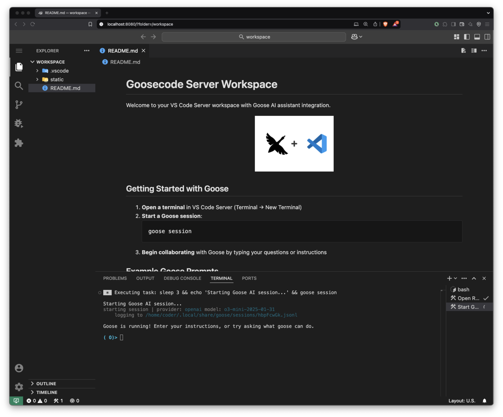

# Goosecode Server

A containerized VS Code server environment with integrated [Goose AI coding agent](https://github.com/block/goose). This project provides a ready-to-use Docker setup that combines VS Code Server with the Goose AI agent, allowing you to access a powerful coding environment through your browser.

<div align="center">
  
</div>

[](https://opensource.org/licenses/Apache-2.0)
[](https://www.docker.com/)
[](https://code.visualstudio.com/)
[](https://openai.com)

## Features

- **Browser-Based Development**: Access VS Code directly from your browser
- **Goose AI Agent**: Pre-installed and configured [Goose AI Coding agent](https://github.com/block/goose)
- **Shared Terminal Session**: The same Goose session is visible in all browser windows
- **Goose Terminal API**: REST API for sending commands to the terminal and retrieving session logs
- **Streaming Conversations**: Real-time streaming of Goose AI conversations using Server-Sent Events (SSE)
- **Material Design**: Dark theme with Material icons for a beautiful coding experience
- **Secure Environment**: Password-protected VS Code Server instance
- **Git Integration**: Git pre-installed and ready for repository operations
- **Persistent Configuration**: Environment variables and configuration preserved between sessions (Unless workspace is deleted)

## Quick Start

1. **Clone this repository**
   ```bash
   git clone https://github.com/PlatOps-AI/goosecode-server.git
   cd goosecode-server
   ```

2. **Create or edit `.env` file with your OpenAI API key**
   ```bash
   cp .env.example .env
   # Edit .env with your API key
   ```
   
3. **Run the container**
   ```bash
   chmod +x run.sh
   ./run.sh
   ```

4. **Access Goosecode Server**
   - Open your browser and navigate to: http://localhost:8080
   - Default password: `talktomegoose` (can be changed in .env)
   - A shared terminal with Goose will start automatically

<div align="center">
  
  <p><i>Example of the VS Code interface in browser</i></p>
</div>

## Using the run.sh Script

The `run.sh` script provides a convenient way to manage your Goosecode Server container. It handles building the image, starting/stopping the container, and passing environment variables.

### Basic Usage

```bash
./run.sh
```

### Advanced Options

You can pass environment variables and configuration options directly to the script:

```bash
./run.sh --openai-key=your_api_key_here --password=your_password --port=8888
```

#### Available Options

| Option | Description | Default |
|--------|-------------|---------|
| `--rebuild` | Force rebuild of the Docker image | - |
| `--port=VALUE` | Host port to map to container | 8080 |
| `--image=VALUE` | Custom Docker image name | goosecode-server |
| `--container=VALUE` | Custom container name | goosecode-server |
| `--openai-key=VALUE` | OpenAI API key | From .env |
| `--password=VALUE` | VS Code Server password | From .env or "talktomegoose" |
| `--github-token=VALUE` | GitHub token | From .env |
| `--git-user=VALUE` | Git user name | From .env or "PlatOps AI" |
| `--git-email=VALUE` | Git user email | From .env or "hello@platops.ai" |
| `--no-terminal-sharing` | Disable shared terminal feature | Sharing enabled by default |
| `--no-goose-api` | Disable the Goose Terminal API | API enabled by default |
| `--api-port=VALUE` | Custom port for the Goose API | 8000 |
| `--goose-session=VALUE` | Specify a Goose session ID | Random session ID |
| `--resume-session` | Resume an existing Goose session | Start new session |

### Environment Variables Priority

1. Command-line arguments (highest priority)
2. Variables from `.env` file
3. Default values (lowest priority)

## Using Goose AI Assistant

Goosecode Server automatically starts a shared Goose AI terminal session when you launch the container. This means:

- The same Goose session is visible in all browser windows
- Multiple users can see and interact with the same conversation
- The session persists even when browser windows are closed

### Accessing the Shared Goose Session

When you open VS Code in your browser:

1. A terminal with Goose AI should open automatically
2. If not, open a terminal in VS Code and run one of these commands:
   ```bash
   # Full interactive mode (default)
   ~/shared-goose.sh
   
   # View-only mode (can't type, just watch)
   ~/goose-view.sh
   ```

3. Each new terminal creates a unique session linked to the shared content
4. Start interacting with Goose by typing your questions or instructions

### Using Environment Variables for Session IDs

You can specify a custom session ID using environment variables:

1. Set the `GOOSE_SESSION_ID` environment variable in your `.env` file or via the `--goose-session` flag:
   ```bash
   # In .env file
   GOOSE_SESSION_ID=my-project-session
   
   # Or when running the container
   ./run.sh --goose-session=my-project-session
   ```

2. To resume an existing session, set the `GOOSE_RESUME_SESSION` environment variable:
   ```bash
   # In .env file
   GOOSE_SESSION_ID=my-project-session
   GOOSE_RESUME_SESSION=true
   
   # Or when running the container
   ./run.sh --goose-session=my-project-session --resume-session
   ```

These variables allow you to maintain consistent session IDs across container restarts or share specific sessions with team members.

### Goose Configuration

Goose is pre-configured with the following settings:

```yaml
GOOSE_PROVIDER: openai
extensions:
  developer:
    enabled: true
    name: developer
    type: builtin
GOOSE_MODE: auto
GOOSE_MODEL: o3-mini-2025-01-31
OPENAI_BASE_PATH: v1/chat/completions
OPENAI_HOST: https://api.openai.com
```

To view your current configuration:
```bash
cat ~/.config/goose/config.yaml
```

To modify your configuration:
```bash
goose configure
```

## UI Customization

The VS Code Server instance comes pre-configured with:

- **Dark Theme**: Easy on the eyes for long coding sessions
- **Material Icon Theme**: Beautiful file and folder icons
- **Material Product Icons**: Enhanced VS Code UI icons
- **Custom Colors**: Optimized color scheme for code readability

## Docker Container Management

### Building the Container
```bash
docker build -t goosecode-server .
```

### Running the Container Manually
```bash
docker run -d -p 8080:8080 -p 8000:8000 --name goosecode-server --env-file .env goosecode-server
```

### Managing the Container
```bash
# Stop the container
docker stop goosecode-server

# Start an existing container
docker start goosecode-server

# Remove the container
docker rm goosecode-server

# View container logs
docker logs goosecode-server

# Access container shell
docker exec -it goosecode-server bash
```

### Customizing Port or Password
```bash
docker run -d -p 8888:8080 -e PASSWORD="your-secure-password" --name goosecode-server --env-file .env goosecode-server
```

## Goose Terminal API

The Goosecode Server includes an HTTP API for interacting with the terminal and accessing Goose conversation logs.

### API Features:

- Send commands to the tmux terminal
- List active tmux sessions
- Retrieve Goose conversation logs
- Stream conversation updates in real-time using Server-Sent Events

The API is enabled by default when starting the container and runs on port 8000.

- Swagger documentation: http://localhost:8000/docs
- API base URL: http://localhost:8000/api/

### Command-line options:

```bash
# Disable the Goose API
./run.sh --no-goose-api

# Change the API port
./run.sh --api-port=9000
```

For more details about the API, including examples and the streaming client, see the [Goose API README](goose-api/README.md).

## Troubleshooting

### Goose AI Issues

| Issue | Solution |
|-------|----------|
| Goose not found | Ensure the installation was successful with `which goose` |
| Configuration errors | Run `goose configure` to set up the agent manually |
| API key issues | Verify your OpenAI API key is correctly set in the `.env` file or passed via command line |
| Shared session not working | Run `~/shared-goose.sh` to connect to the shared session |
| Scrolling affecting other clients | Each window should have its own session; check the status bar for your session name |
| Need view-only access | Run `~/goose-view.sh` for read-only mode |

### Container Issues

| Issue | Solution |
|-------|----------|
| Port conflicts | Change the port mapping using `--port=VALUE` option |
| Permission issues | Container uses the `coder` user; use `sudo` for privileged operations |
| Performance issues | Adjust Docker resource allocation in Docker Desktop settings |
| Environment variables not working | Check priority order: command line > .env file > defaults |
| API not accessible | Ensure port 8000 is published with `-p 8000:8000` and the API is enabled |

---

Built with ❤️ for developers